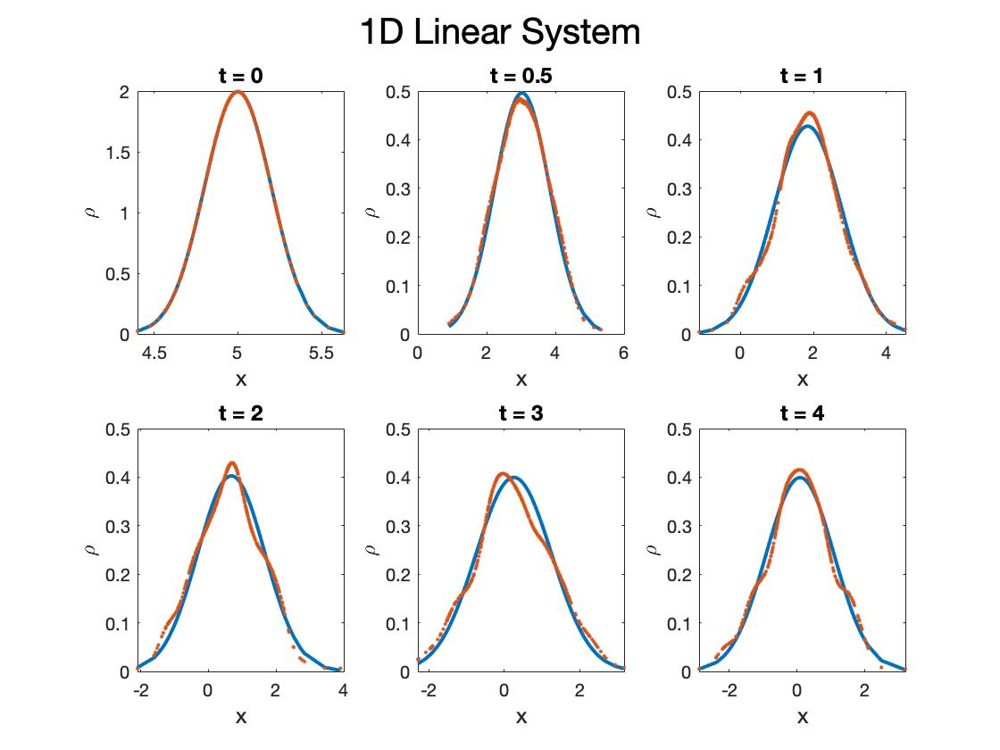
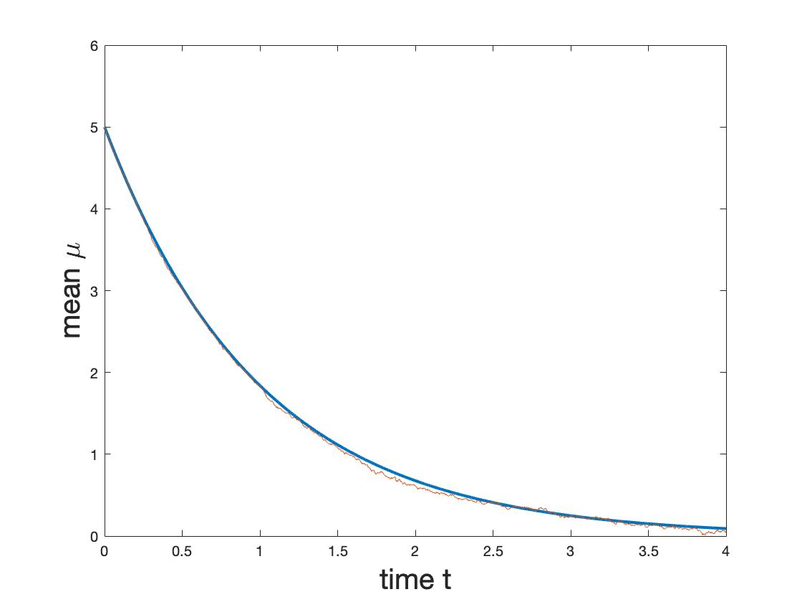
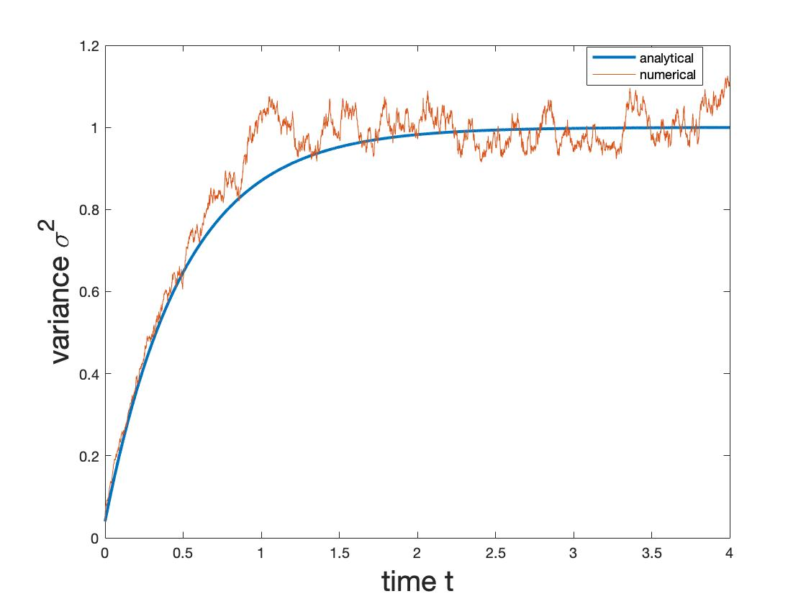
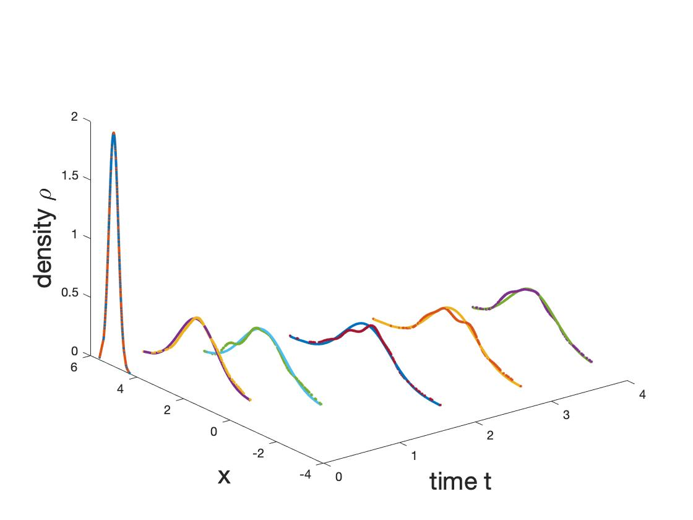

# User Guide

## Introduction 

This is a Fokker-Planck-Kolmogorov PDE solver for 1D Ornstein Uhlenbeck System and 
a 2D Potential Nonlinear System.

**NOTE**: This solver only supports the above systems currently. There is on-going work on applications to more general systems.


## Example:

This are a sample plots for a 1D system. The required inputs are explained below in further details.
The User is recommended to edit the file Main.m to see the entire file and change some of the inputs.

 
The first figure creates 6 subplots of the transient PDFs at different time specified by the user. 


The second figure compares the analytical mean with the numerical mean.


The third figure compares the analytical variance with the numerical variance.


The last figure plots the transients in one plot. 


## Required Inputs from the User:

All parameters are dimensionless. 

1. *dim*: Determines the spatial dimension of the system of interest. In this case, input should be  either 1 or 2.  

    ```matlab
    dim = 1
    ```
 2. *beta*: The diffusion coefficient which determines the strength of the noise/randomness added the system
  
  ```matlab
    beta  = 1
    ```
 
 3. *nSample*: The number of PDF point values to be plotted. Typical values for good visualization should be chosen to be in 200-500 range. In the example above, we choose *nSample* = 400.
 
  ```matlab 
    nSample = 400 
    ```
 4. *alpha*: The drift coefficient which determines the strength of the drift or the deterministic part of the system.
 
 ```matlab 
    alpha = 1
    ```
 5. *epsilon*: The regularization coefficient which "smooths" out the solutions. Suggested values are 
 *epsilon* = 0.001-0.1 range. If chosen too big, the plots will under match. If chosen too small, the plots will be grainy.
 
 ```matlab 
    epsilon = .01
    ```
 Here is an example of *epsilon* chosen to be too small.   
